# Restaurant Management System 
## 1. Services

## 2. Book tables
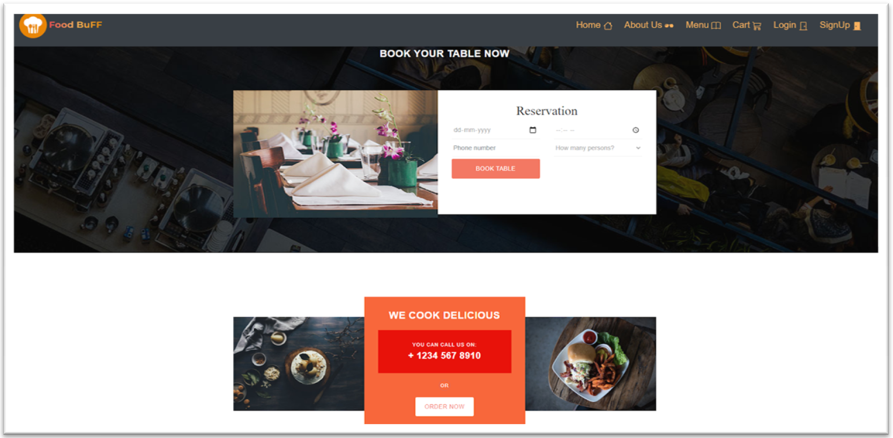
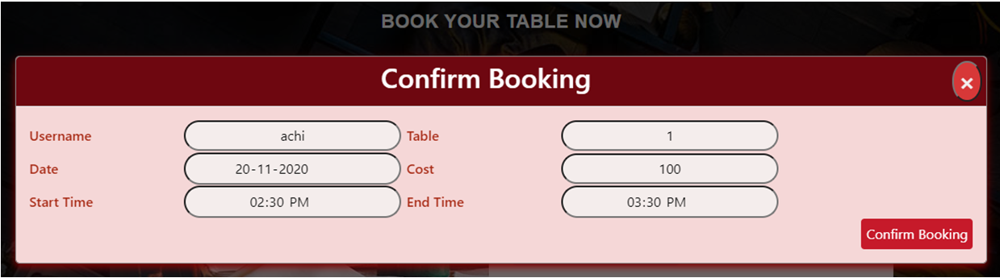
## 3. Browse Menu
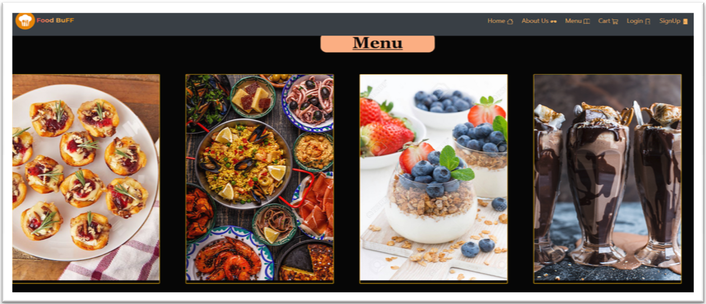
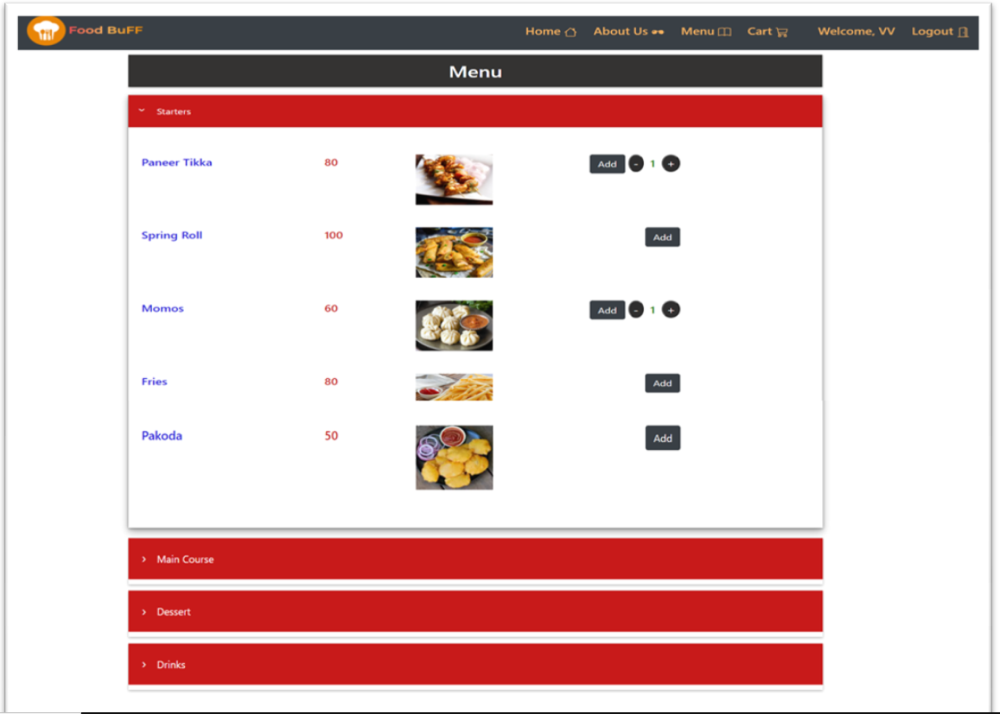
## 4. Signup Sign-In facilities
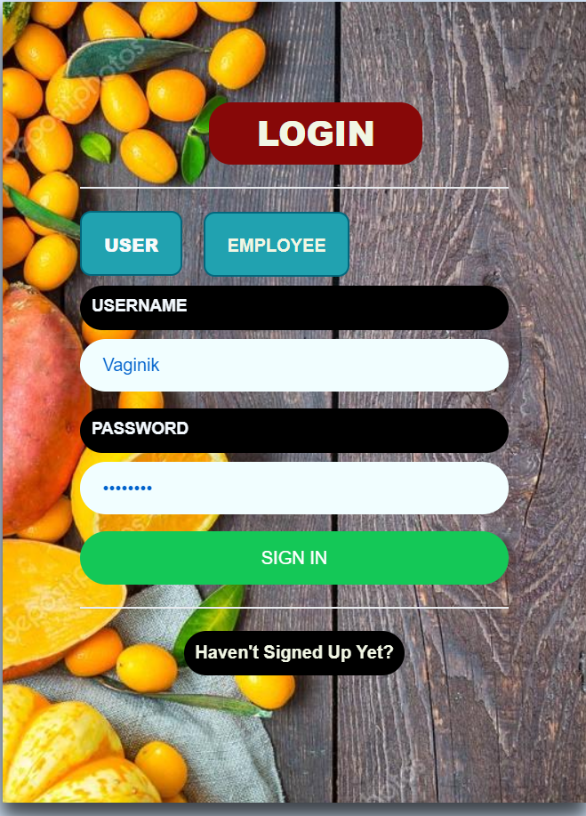
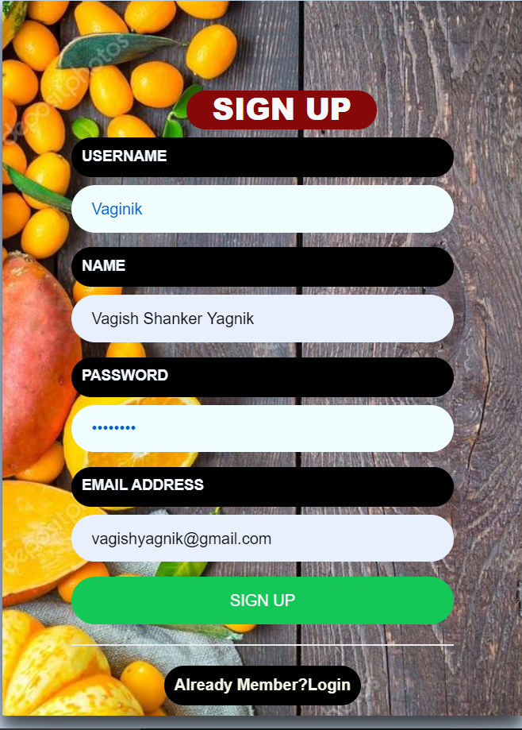
## 5. View Cart
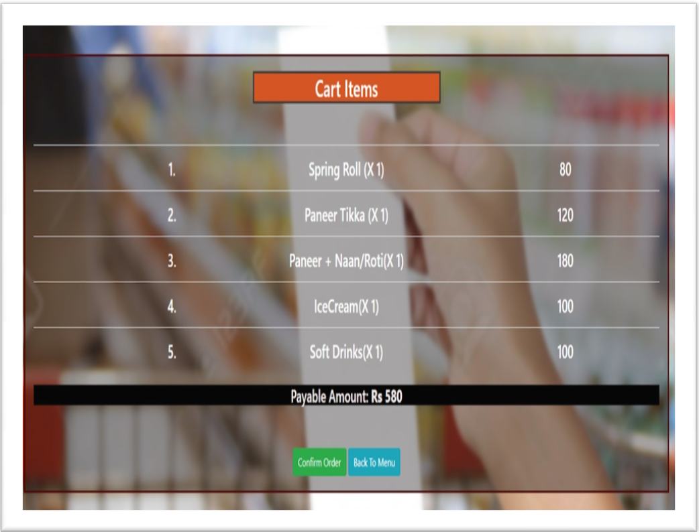
## 6. Add, Update, Delete and View Employees
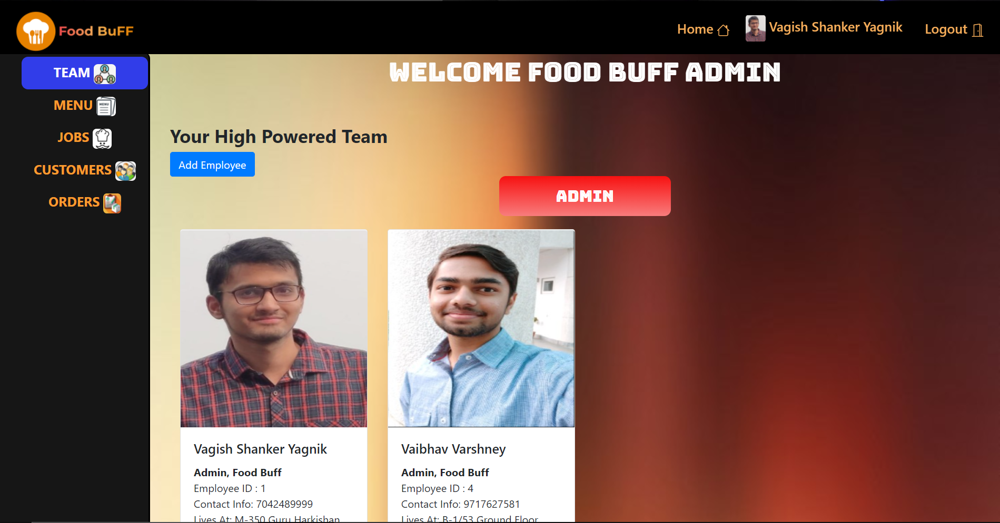
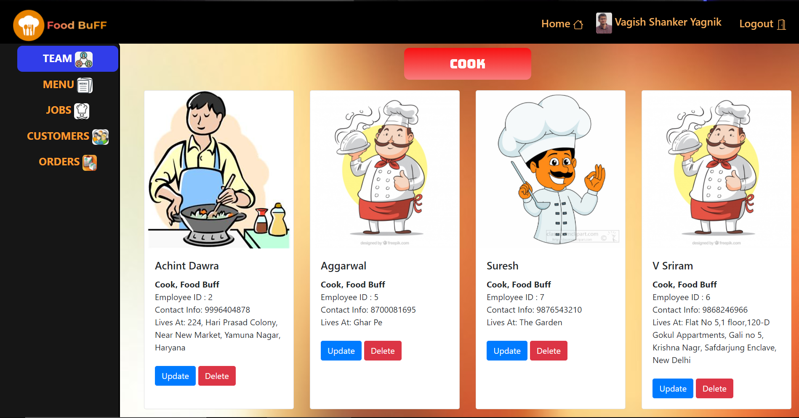
## 7. Add, Update, Delete and View Jobs
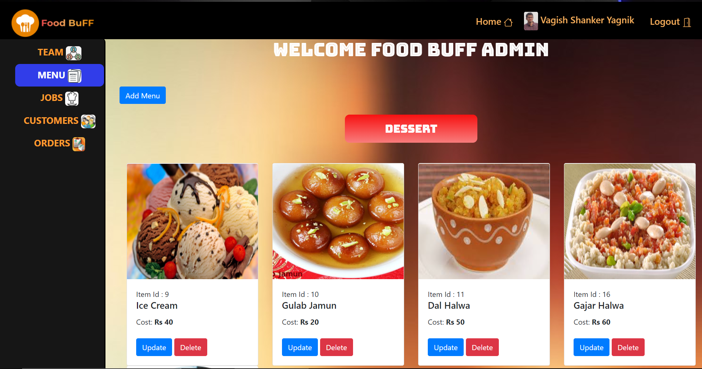
## 8. View all registered customers
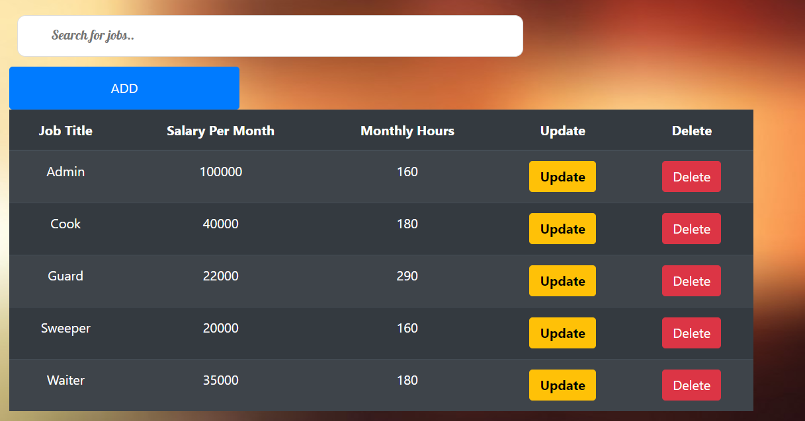
## 9. View all orders by customers
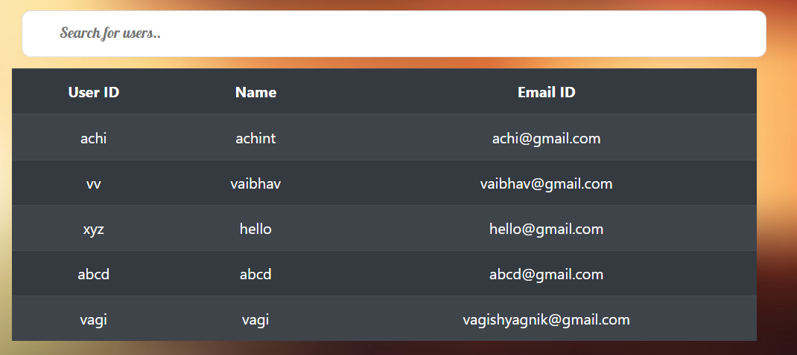
## 10. View All Payments and Transactions
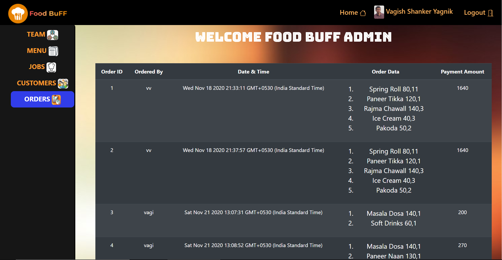
